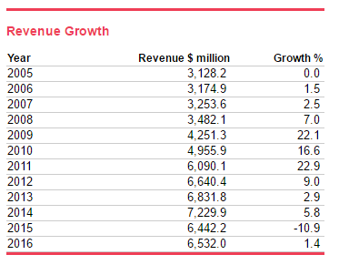

```{r setup, include=FALSE}
knitr::opts_chunk$set(echo = F)
```
# Introduction
## Report Topic

Canada in the modern times is a product of its history and economic growth from confederation and on wards.  While Canadians are well versed in the customs, symbols, and events of the past, most do not consciously relate the economic impacts of these cultural artifacts to the economic effects that correspond to them. The motivation for this paper is to develop a, limited, narrative that interrelates some key developments within Canada to their national economic impacts.

This paper explores Canada’s economic growth over the 21st century. It maps Canada's economic developments in response to the economic/social/political change over this period. While this paper will focus upon developments within the time frame from 2000 - present, it is difficult to talk about certain topics without the context of previous economic events. Thus, we may reference back to longer periods of time where needed.

To modularize this analysis, economic developments at an aggregated regional level first then decomposed and matched to economic events at a provincial level where possible.

## Key Insights

* Ontario & Alberta Are Key Contributors To Canada's Economic Growth

* Construction and trade services dominate industry growth from 2000-2015

* Population growth doesn't necessarily follow GDP growth, but the relation is strong nevertheless.

* Immagration can make upto half of the population growth in growing areas of Canada.

* Canadians are working longer into their lives, the proportion of workers in the 45-over range is increasing.

* Stark differences in unmployment between Eastern and Western Canada

* The oil slump's effects on Oil and Gas producing provinces is worst than the 2008 recession in unemployment andd exports terms.

* Alberta's CPI is significantly higher than the other provinces.

* Ontario and Alberta act as polar opposites dominiating imports and exports.

* The two of the top exporting industries in 2016 were multitudes smaller in 2000.

* While the automotive industry is Canada's largest export, over the 2000-2016 period, it had only growth in imports not exports.

## Open Questions

* Why the decline in goods producing industries stop around 2008? (In Ontario at least)

* While Canada's investment and development in the Pharmacetuicals has slowed compared to early 2000's what's keeping this industry developing at a similar rate?

* Since Gold and Silver has become a major export for Canada, why is there no significant growth in the other metrics of development in mining areas?

* What caused the decline in Forestry related products?

## Data Sources

Much of the data is sourced from CANSIM/Statistics Canada. This includes the following:

* GDP By Industry andd Province
* Population By Province
* Labour Force By Province
* Employment
* Unemployment
* CPI
* Age Demographics

Data regarding balance of trade is from Industry Canada, this includes:

* Imports By Industry
* Exports By Industry

Industry specific information from:

* IBIS World
* Various sources mentioned alongst analysis

Where CANSIM data is incomplete or fragmented, World Bank, UN, and provincial official data is used.
## Definitions

At times we aggregate data into region levels above the provincial and territorial level. This is to facilitate better comparison where otherwise values are too small for meaningful comparison. 

* Western Canada
	+ British Columbia Alberta Manitoba Saskatchewan
* Eastern Canada
	+ Ontario Quebec New Brunswick Prince Edward Island Nova Scotia Newfoundland and Labrador
* Northern Canada
	+ Yukon Northwest Territories Nunavut

\pagebreak

#GDP
### Overview
```{r,fig.align='center', fig.width=5, fig.height=3}
GDP_Overall <- read.csv("Data/GDP_Overall.csv", header = T, stringsAsFactors = F)

plot( GDP_Overall$Indicator.Name
	 ,GDP_Overall$GDP..current.US..
	 ,type = "l"
	 ,main = "Canada Gross Domestic Product"
	 ,sub  = "(current USD)"
	 ,ylab = "US Dollars"
	 ,xlab = "Years"
	 ,yaxs = "i"
	 ,cex  = 0.7
	 ,cex.axis = 0.5
	 ,cex.lab = 0.5
	 ,cex.main = 0.6
	 ,cex.sub = 0.6
	 )

text(1998
	 ,0.9E12
	 ,labels = "US dot com bubble"
	 ,cex    = 0.4
	)
	  
text(2008
	 ,1E12
	 ,labels = "Global financial crisis"
	 ,cex    = 0.4
)

text(2013
	 ,1.5E12
	 ,labels = " 2014/15 Oil Slump"
	 ,cex    = 0.4
)
```
Canada's Economy has seen enormous economic growth over the 21st century. From shortly after 200 and on wards, GDP grew substantially faster than previous periods before 2000. While impressive, Canada's ranking in incremental nominal GDP has actually gone down. By IMF estimates, Canada was ranked as the 5th largest economy during the 1995-2000 era as compared to it's current (2016) ranking at 10th place. It is a testimony to the explosive growth rates of globalization in progress.

From this series, we draw three distinct downturns that have negatively affected the Canadian economy overall. 

* US dot com bubble
	+ The information technology bubble originated from the United States and had limited affects in Canada. This bubble was triggered by 				speculation in internet based enterprise upon US stock exchanges. In Canada, there was some spillover between US markets and the Toronto	 		Stock Exchange. 
* 2008 Global Financial Crisis
	+  During this time, the US crisis in the financial/credit flows spilled over borders and translated into a recession for Canada. Much a like 	the dot com bubble, Canada was insulated from the full effects of the crisis. Canada had better regulation and stricter capital controls. Where 	the US government had to issue a series of bailouts for major financial firms, Canadian firms did not fail.
* 2014/15 Oil Slump
	+ More recently, the oversupply of crude oil has had it's impact on Canadian GDP. Crude oil has dropped from prices around $125 USD to only 		$30 during early 2016. From Canada's prospective, oil extraction doubled from 2008 to present.

## Provincial View

```{r, fig.align= "center",warning=FALSE, , fig.width=5, fig.height=5}
# Save Old Parameters
opar = par()

par(mfrow=c(2,1))

# Transpose and Remove Aggregations From Data Table
Provinces <- read.csv("Data/GDP_Provinces.csv", header = T, stringsAsFactors = F)
Prov = data.frame(t(Provinces), stringsAsFactors = F)

names(Prov) = Prov[1,]

Prov = Prov[-1:-5,]

# Plot Dot charts

temp = Prov[order(Prov$`2015`),]

dotchart(
	temp$`2000`
	,labels = row.names(temp)
	,cex = 0.6
	,main = "Provincial GDP 2000"
	,sub  = "2007 Dollars"
	,xlim = c(0,650000)
)

temp = Prov[order(Prov$`2015`),]

dotchart(
	temp$`2015`
	,labels = row.names(temp)
	,cex = 0.6
	,main = "Provincial GDP 2015"
	,sub  = "2007 Dollars"
	,xlim = c(0,650000)
	)

par(opar)

```
Canada's provincial contribution to the national GDP can be categorized into three levels. From the dotchart, there is a distinction between dominant contributors, secondary contributors, and minor contributors. Primary Contributors would be the province of Ontario. The vast majority of growth within the 15 years is centered within the province. Secondary contributeors would be composed of Quebec, British Columbia, and Alberta. In the time period, the distinction between Quebec and the western secondary provinces in lessened. In history of Canada we expect Quebec to be more developed than the later settled Western provinces. Below that, the other provinces show a jagged growth pattern. It would seem that some provinces were favored more-so than others.  

Over the 2000 - 2015 period, a few key trends emerge. Note the fixed axis. Ontario leads GDP growth on an absolute basis. While Alberta and British Columbia start off at approximately the same levels, Alberta's GDP overtakes British Columbia. On a smaller scale, Saskatchewan and Manitoba.

## Industries View

```{r,fig.align='center', fig.width=4, fig.height=4}
# Transpose and Remove Aggregations From Data Table
GDP_Ind <- read.csv("Data/GDP_1997_Industry_CPI2007.csv", header = T, stringsAsFactors = F)

temp = data.frame(t(GDP_Ind), stringsAsFactors = F)
names(temp) = temp[1,]
temp = temp[-1,]


temp = temp[order(temp$`2000`),]

dotchart(
	temp$`2000`
	,labels = row.names(temp)
	,cex = 0.44
	,main = "Industry GDP 2000"
	,sub  = "2007 Dollars"
	,xlim = c(0,1656117)
)
temp = temp[order(temp$`2015`),]
dotchart(
	temp$`2015`
	,labels = row.names(temp)
	,cex = 0.44
	,main = "Industry GDP 2015"
	,sub  = "2007 Dollars"
	,xlim = c(0,1656117)
)
```
*Note that the items listed above all industries are unsorted, these categories did not exist before 2007.

Canada continues to evolve into a service based economy. Note the fixed axis. In 2000, we see that the services industry had already outpaced the manufacturing industry. However, by 2015 the service sector appears to have signficant growth where as manufacturing is nearly at a stand still. The decline of manufacuring in Canada could be understood in the context of Economic Globalization. Going past 2000, it has become increasingly popular to move manufacuring related activies to lesser developed countires. In the process, develpoed countries such as Canada geared towards more knowledge and intellectual jobs and industries. For example, after 2001, China became a popular location of manufacuring after joining the World Trade Organization.
```{r,fig.align='center', fig.width=4, fig.height=4}
GDP_Ind <- read.csv("Data/GDP_2000-2015Growth.csv", header = T, stringsAsFactors = F)


GDP_Ind <- GDP_Ind[order(GDP_Ind$Total.Growth),]

dotchart(
	GDP_Ind$Total.Growth
	,labels = GDP_Ind$Industry
	,cex = 0.5
	,main = "Industry Growth 2000-2015"
	,sub  = "%"
	,xlim = c(-0.10,1.00)
)
```
*Note that items use either the year 2000 or the year first introducted as the base year, often 2007. See above for the introduced industries.

Naturally, we see the same story in the growth rates of services and manufucturing in their respective growth rates. Most manufacturing sectors suffered a decline whilelist services obtain growth rates as high as up to 66%.

It is interesting to see that construction, real estate, and financial services take up top spots in the 2000-2015. In the timeframe, we consider the effects of the housing market bubble, a rising Canadian population, and the prospect of Canada as an increasingly attractive immagration area. Considering these factors, the following is presented from the 2010 Canada Year Book:

> Canadian cities are not only growing out, they're growing up. Builders are adapting to land shortages and to the evolving lifestyles of Canadians by building more apartments and condominiums, maximizing the use of available space.

> The growing share of apartments and condominiums is more obvious in Canada's largest cities. In 1991, 90% of all condominiums were located in the country's 25 largest cities. Today, the largest cities continue to see the greatest growth in high-density residential construction.

> Among the three component industries, engineering, repair and other construction services contributes the largest share to construction GDP. In 2010, it accounted for 54.0% of construction GDP, or $39.9 billion. Residential building construction contributed $23.4 billion, while non-residential building construction contributed $10.8 billion.
CanadaYearBook : http://www.statcan.gc.ca/pub/11-402-x/2011000/chap/construction/construction-eng.htm

## Case: GDP Growth From Ontario

Let's examine one of the major sources of GDP growth in Canada. From my (our) perspective, much of Canada's economic growth is dominated by news surrounding the oil and gas industry and developments in Western Canada. This is ofcourse subject to the homeward bias's as a Western Candian. From an objective point of view, we do expect much of the GDP growth to be concentrated within Eastern Canda however given it's longer economic history, the larger developed landmass and a larger population. 

```{r,fig.align='center', fig.width=7, fig.height=4, warning = FALSE}
opar = par()

par(mfcol = c(1,2))


GDP_ON_Proportions <- read.csv("Data/GDPProportions_Ontario.csv", header = T, stringsAsFactors = F)

plot(
	GDP_ON_Proportions$Year
	,GDP_ON_Proportions$Goods.producing.industries
	,ylim = c(0,80)
	,ylab = "Percentage of Total"
	,xlab = "Year"
	,type = 'l'
	)

lines(
	GDP_ON_Proportions$Year
	,GDP_ON_Proportions$Service.producing.industries
	,col = "blue"
)

lines(
	GDP_ON_Proportions$Year
	,GDP_ON_Proportions$Manufacturing
	,col = "red"
)

lines(
	GDP_ON_Proportions$Year
	,GDP_ON_Proportions$Industrial.production
	,col = "green"
)


legend("topleft"
	   ,legend = c("Goods Industries","Service Industries","Manufacturing","Industrial Production")
	   ,col = c("black","blue","red","green")
	   ,cex = 0.6
	   ,lty = 1
)

matplot(
	GDP_ON_Proportions[-1]
	,ylim = c(0,30)
	,ylab = "Percentage of Total"
	,xlab = "Year Index"
	,type = 'l'
)
par(opar)
```

The first graphic highlights the decline of manufacuring industries over the 2002-2015 period. Around a new classification system using services versus goods producting industry replaces the older system. Nevertheless, using any of the three variables to control for goods production we can see that in the linear decline of good production in Canada. Manufacturing in 2000 represented 21.72% of the provincial GDP while in 2015 it represented only 12.14%. It's interesting to note that the trend continues untill the 2008/2009 mark during which the global financial crisis occurs and runs its course to recovery. Prehaps after this point the gains to offshoring manufacturing, cost savings in an low employment situtation or offshoring awareness and costs to publicity outweiged the benefits to continue further.

In the second graphic, we plot all industries tracked and defined as a proportion of GDP by Statisics Canada. We wish to focus upon the overall changes within the compoents that make up Ontario's GDP. That is to ask, if manufacuring industries are in decline then what offsets and grows beyond this loss? As it turns out, much of the industry proportions show a consistent linear pattern demonstrating uniform growth over the period. Ofcourse there must be above average grow in select industries for there to be an average metric. We see that in construction, professional & scientific services, real estate and public administration industries a change of more than 1% in proportion to other industries.

\pagebreak

#Demographics
## Population
```{r,fig.align='center', fig.width=5, fig.height=3}

Population <- read.csv("Data/Population2000.csv", header = T, stringsAsFactors = F)

plot(Population$Geography
	 ,Population$Ontario
	 ,type = "l"
	 ,main = "Canada Population - Top 4 Provinces"
	 ,ylab = "Persons"
	 ,ylim = c(0,14000000)
	 ,xlab = "Year"
)

lines(Population$Geography,Population$Quebec,col = "blue")
lines(Population$Geography,Population$Alberta,col = "red")
lines(Population$Geography,Population$British.Columbia,col = "green")

legend("bottomleft"
	   ,legend = c("Ontario","Quebec","Alberta","British Columbia")
	   ,col = c("black","blue","red","green")
	   ,lty = 1
	   ,cex = 0.5
	   )
```
In absolute terms, Canada's population is increasing at a steady rate. Following GDP, let's see how the demographics of Canada has help shaped or have been shaped by Canada's Economic Disposition. We see that the gap between the populations of Alberta and British Columbia close. It seems as though from 2005 and onwards, Alberta maintains a level of linear population growth per year. This corresponds to the advent of the oil and gas sector in Alberta. Following 2003, increasing oil prices and innovations in oil & gas extraction led to many oil and gas related developments. The spin-offs from petroleum allowed Alberta to develop many other industries

## Population Growth

```{r, fig.align= "center",warning=FALSE, , fig.width=7, fig.height=4}
Pop.Growth <- read.csv("Data/Population2000growth.csv",header = T, stringsAsFactors = F)

opar = par()

par(mfrow = c(1,2))

# Eastern Canada
plot(Pop.Growth$Geography,
	 Pop.Growth$Ontario
	 ,ylim = c(0,0.07)
	 ,type = "l"
	 ,main = "Eastern Canada"
	 ,xlab = "Year"
	 ,ylab = "Percent Growth"
	 )

lines(Pop.Growth$Geography,Pop.Growth$Quebec, col = "blue")
lines(Pop.Growth$Geography,Pop.Growth$New.Brunswick, col = "red")
lines(Pop.Growth$Geography,Pop.Growth$Prince.Edward.Island, col = "green")
lines(Pop.Growth$Geography,Pop.Growth$Newfoundland.and.Labrador, col = "orange")
lines(Pop.Growth$Geography,Pop.Growth$Nova.Scotia, col = "purple")

legend("topleft"
	   ,legend = c("Ontario","Quebec","New Brunswick","PEI","Newfoundland","Nova Scotia")
	   ,col = c("black","blue","red","green","orange","purple")
	   ,lty = 1
	   ,cex = 0.7
)
# Western Canada

plot(Pop.Growth$Geography
	 ,Pop.Growth$British.Columbia
	 ,ylim = c(0,0.07)
	 ,type = "l"
	 ,main = "Western Canada"
	 ,xlab = ""
	 ,ylab = ""	 
	 )
lines(Pop.Growth$Geography,Pop.Growth$Alberta, col = "blue")
lines(Pop.Growth$Geography,Pop.Growth$Manitoba, col = "red")
lines(Pop.Growth$Geography,Pop.Growth$Saskatchewan, col = "green")

legend("topleft"
	   ,legend = c("BC","Alberta","Manitoba","Saskatchewan")
	   ,col = c("black","blue","red","green")
	   ,lty = 1
	   ,cex = 0.7
)

par(opar)
```
Western provinces grew faster in population than their Eastern counterparts. In comparison to GDP growth, we see that Ontario, BC, and Alberta leading Eastern and Western Canada.

If this attribution is appropreate, it is interesting to see that the 2008 recession appeared to have a direct relation to the population growth of Eastern Canada while the effect for Western Canada lagged behind a couple of years. 

It is also interesting to note that Saskatchewan went from a province of low to no population growth to a province which became the second highest growing province in Western canada.

From the compoents of population growth, we see that in Ontario and generally Eastern provinces, population growth is largely driven by births within the country. In comparsion, in Western provinces, immagration countinued to experience growth up to the point where immagration and births attributed even amounts to population growth.
Using Saskatchewan as an example, in 2000 there were 1,843 immagrants compared to the 12,084 births. In 2015, there were 15,006 immagrants compare to 15,969 births.

> From: CANSIM Table 051-0004 - Components of population growth, 		Canada, provinces and territories 									http://www5.statcan.gc.ca/cansim/a26

A possible explanation connecting the population growth of provinces, immagration, and the GDP growth experienced in certain provinces is the opportunities created by the advent of new industries and their developments. The following report highlights the skills shortage in select Canadian provinces, and the effects on temporary workers. It notes that AB,BC,ON,QC for their extensive use of the forigen workers program, a proxy for the demand for labour.  

> The introduction, in September
	2007, of the Expedited Labour Market Opinion (ELMO)
	Pilot Project, helped businesses in Alberta and
	British Columbia to avoid this cost by facilitating
	hiring of temporary foreign workers in high-demand
	occupations. 

> http://www.pbo-dpb.gc.ca/web/default/files/files/files/TFW_EN.pdf

## Labour Force

```{r, fig.align= "center",warning=FALSE, , fig.width=7, fig.height=4}
opar = par()

par(mfrow = c(1,2))
# Labour Force Population
LabourForce <- read.csv("Data/LabourForce_Canada.csv", header = T, stringsAsFactors = F)

plot(LabourForce$Year,
	 LabourForce$X15.24
	 ,ylim = c(0,10000)
	 ,type = "l"
	 ,xlab = "Year"
	 ,ylab = "Thousands"
)

lines(LabourForce$Year, LabourForce$X25.to.44.years, col = "blue")
lines(LabourForce$Year, LabourForce$X45.to.64.years, col = "red")
lines(LabourForce$Year, LabourForce$X65.years.and.over, col = "green")

legend("topleft"
	   ,legend = c("15-24","25-44","45-64","65-Over")
	   ,col = c("black","blue","red","green")
	   ,lty = 1
	   ,cex = 0.55
	   ,title = "Age Groups"
)
# Labour Force Growth Rates
LabourForceGrowth <- read.csv("Data/LabourForce_Canada_alt.csv", header = T, stringsAsFactors = F)

plot(LabourForceGrowth$Year,
	 LabourForceGrowth$X15.years.and.over
	 ,ylim = c(0,0.15)
	 ,type = "l"
	 ,xlab = "Percent Growth"
	 ,ylab = "Thousands"
)

lines(LabourForceGrowth$Year, LabourForceGrowth$X25.years.and.over, col = "blue")
lines(LabourForceGrowth$Year, LabourForceGrowth$X45.years.and.over, col = "red")
lines(LabourForceGrowth$Year, LabourForceGrowth$X55.years.and.over, col = "green")
lines(LabourForceGrowth$Year, LabourForceGrowth$X70.years.and.over, col = "orange")

legend("topleft"
	   ,legend = c("15-Over","25-Over","45-Over","55-Over", "70-Over")
	   ,col = c("black","blue","red","green","orange")
	   ,lty = 1
	   ,cex = 0.55
	   ,title = "Age Groups"
)

par = opar
```
We can see that Canada's work force is aging. There seems to be a shift early on during the 21st century where the proportion of older workforce participants starts to match the proportion of younger workforce participants. Note that the work force participants in the age bins of 15-24 and 25-44 stay largely constant whilist the age bin of 45-64 climbs significantly over the 2000-2015 period. Likewise, there is a slight gain in workforce participants over the age of 65. 

Note the age groups adjustment in the percent growth graph.

Looking at the growth graph, we can see some trends and key events panning out amongst the work force. Firstly, that the 45-over age bin starts to growth faster than the overall proportion of workers as measured by the 15-over bin sometime before the 21st century. We expect that this divergence only started shortly before the year 2000 as at that point the gap between to the 45-64 and 25-44 bins in the absolute scale graph is still significant. It's interesting to see this trend taper off after the 2008 recession.

Looking at the effects of the 2008 recession we see that the labour force experiences negative growth overall presumably because of labour force exclusions of discouraged workers. Note that the growth rate after the recession never picks back up. One narrative is prehaps those who've made it into the 45 and over bin are seperated into those who had to work longer till retirement and those who could already retire confortably afterwards. As an aside, currently we have not introduced the unemployment data that would like be material in this discussion.

While the overall trend of a growing workforce in the 45-over bin has diminished, the effects in the 55-over andd 70-over categories did not. Pre and Post recession the largest growth occured in these bins. Prehaps one explanation is that pre 2008 increases in housing prices made retirement difficult for aspiring homeowners and post 2008 those who've relied upon the house market, we leave this definition broad deliberately, could not do so in such an enviroment anymore. 

The economic implications of an aging workforce is significant. Could Canada maintain the GDP growth experienced in the early 2000's if it's workforce continues to do similiarly to that period?

From the Globe and Mail (http://www.theglobeandmail.com/globe-investor/retirement/the-boomer-shift-how-canadas-economy-is-headed-for-majorchange/article27159892/)

>  The result will be a dramatic greying of Canada’s demography – one that has serious implications for the national economy, government policy and the well-being of its citizens. Without significant adjustments, we could be headed for decades of anemic economic growth, shrinking per capita incomes and eroding wealth. Governments could face skyrocketing deficits and tough choices about what kinds of health care and social supports we can afford, as a smaller pool of taxpayers must fund the rising costs of the growing numbers of seniors. The gaps between the wealthy and poor may widen into gaping social wounds, as the adequacy of pensions and private savings are tested to their limits.

>  The biggest challenge for the Canadian economy – as well as those of most major Western countries whose populations are similarly maturing – is that the looming retirement of the boomer generation amounts to a giant brake on the labour force. Labour growth is the key ingredient in the production of more goods and services that adds up to economic expansion. And it is now face to face with a massive and irreversible demographic threat.

> “Inevitably, the aging of the population, with more and more people exiting the work force either full-time or part-time – labour force growth slows down,” said David Foot, economics professor at the University of Toronto and author of the 1996 bestseller Boom, Bust & Echo, the seminal work on the economic influence of the boomer generation. “And since labour [growth] is two-thirds of economic growth, inevitably economic growth slows down. So as we look forward, much slower economic growth will be the norm.”

\pagebreak

# Employment and Unemployment
## Unemployment
```{r, fig.align= "center",warning=FALSE, , fig.width=7, fig.height=4}
opar = par()

par(mfrow=c(1,2))

Uemp_prov <- read.csv("Data/Unemployment_Provinces.csv", stringsAsFactors = F, header = T)

# Western Canada
plot(
	Uemp_prov$Year
	,Uemp_prov$Canada
	,main = "Western Canada"
	,xlab = "Year"
	,ylab = "Percent"
	,ylim = c(0,20)
	,type = "l"
	,cex.main = 1
)

lines(Uemp_prov$Year,Uemp_prov$British.Columbia,col = "blue")
lines(Uemp_prov$Year,Uemp_prov$Alberta,col = "red")
lines(Uemp_prov$Year,Uemp_prov$Manitoba,col = "green")
lines(Uemp_prov$Year,Uemp_prov$Saskatchewan,col = "orange")


legend("bottomleft"
	   ,legend = c("CAN","BC","AB","MA","S")
	   ,col = c("black","blue","red","green","orange")
	   ,lty = 1
	   ,cex = 0.6
)
# Eastern Canada
plot(
	Uemp_prov$Year
	,Uemp_prov$Canada
	,main = "Eastern Canada"
	,xlab = "Year"
	,ylab = "Percent"
	,ylim = c(0,20)
	,type = "l"
	,cex.main = 1
)

lines(Uemp_prov$Year,Uemp_prov$Ontario,col = "blue")
lines(Uemp_prov$Year,Uemp_prov$Quebec,col = "red")
lines(Uemp_prov$Year,Uemp_prov$New.Brunswick,col = "green")
lines(Uemp_prov$Year,Uemp_prov$PEI,col = "orange")
lines(Uemp_prov$Year,Uemp_prov$Nova.Scotia,col = "pink")
lines(Uemp_prov$Year,Uemp_prov$Newfoundland.and.Labrador,col = "purple")

legend("bottomleft"
	   ,legend = c("CAN","ON","QB","PEI","NS","NFLL")
	   ,col = c("black","blue","red","green","orange","pink","purple")
	   ,lty = 1
	   ,cex = 0.6
)

par(opar)
```
Unemployment in Canada as a whole flucuates between 6-8 percent in the 21st century. For perspective on the 2008 recession, we've included the period leading into the 21st century. While unemployment rates during the recession peaked around 8-9 percent in the eariler decade, rates had peaked around 10-11 percent. This shows that Canada was relatively insulated from the recession's full effects.

We see the stark difference in unemployment rates between Western and Eastern Canada. Using Canada's overall unemployment rate as a baseline, it would see as though there is a clear distinction between Eastern and Western Canada's economic prospects. We note however, that Quebec and Ontario, the largest provinces in Eastern Canada do not show significant gaps from Canada's overall unemployment rate.

In terms of unemployment, we see that the oil slump has had an arguably larger impact on the procinces of Alberta and Saskachewan than the 2008 global recession. At the same time, it is reassuring to note that while oil and gas is a major industry for Canada, the largest source of growth in GDP coming from Ontario appears to be resilient to the effects of the oil slump.

From The Canadian Encyclopedia: http://www.thecanadianencyclopedia.ca/en/article/manufacturing/

> Economic and regulatory changes affecting Canadian manufacturing in the last quarter of the 20th century further intensified in the 21st century. By the 2000s, the manufacturing sector had declined significantly. Between 2004 and 2008, about one in seven (or 322,000) manufacturing jobs had disappeared. This trend is not unique to Canada: the majority of Organisation for Economic Co-operation and Development (OECD) member countries are experiencing a similar decline. Contributing factors include production moving to countries such as China, an aging population (leading to an increased demand for services over manufactured goods) and tariff reduction.

> With the exception of the production of transportation equipment (excluding automobiles), oil and coal products, and computers and electronics, all other segments of manufacturing have experienced a downturn. The textile industry, historically one of the largest manufacturing employers in the country, is one of the hardest sectors hit. For example, between 2004 and 2011, jobs at textile mills decreased by over 60 per cent. The automotive sectors, as well as lumber and paper industries, are also in rapid decline, particularly after the 2008 recession.

> In response to these changes, Canadian manufacturers are increasingly focused on production for domestic markets as globalized manufacturing and distribution networks undermine production for export. Central Canada continues to dominate the bulk of manufacturing output, with Ontario representing approximately 46 per cent and Québec approximately 24 per cent of total manufacturing sales. Many consumer goods industries are concentrated in these two provinces, which have well over half the country's population.

## Employment
```{r, fig.align= "center",warning=FALSE, , fig.width=7, fig.height=6}
Emp_CAN <- read.csv("Data/Employment_Canada.csv", header = T, stringsAsFactors = F)

Emp_CAN = t(Emp_CAN)

temp = Emp_CAN[,c(1,16)]

temp = temp[-1,]

dimnames(temp)[[2]] = c("2000","2015")

temp = temp[order(temp[,1]),]


dotchart(temp
		 ,cex = 0.55
		 ,main = "Employment In Canada"
		 ,xlab = "1000's"
		 )
```

We can see the GDP growth of the services sector in the number of peoples employed over the 2000 to 2015 time frame. We see that Canada's labour force increased over the period of time with which nearly all growth this focused into the services sector. The healthcare industry has overtaken the next two largest industries. In the context of an ageing, growing, and a health concious population, this is appropreate. 

> On Health and Wellness Trends

> http://www.bordbia.ie/industry/manufacturers/insight/publications/bbreports/ConsumerLifestyleTrends2015/Consumer-Lifestyle-Trends-Health-and-wellbeing.pdf

Eariler, we saw that construction was a major growing industry over the 2000-2015 time period yet this effect isn't as notable on the population of people employed within the sector. We suggest two reasons for this, that innovation has been the primary driver of construction related GDP growth or possibly the current oil slump has had such a severe effect upon the industry. Verifing the latter we see that construction in the years before 2015 are relatively stable.

```{r echo = FALSE, results= 'markup'}

Emp_CAN <- read.csv("Data/Employment_Canada.csv", header = T, stringsAsFactors = F)

tail(Emp_CAN[c(1,5,10)])
```

> How Technology Is Disrupting The Construction Industry

> http://www.forbes.com/sites/mikekavis/2016/07/12/how-technology-is-disrupting-the-construction-industry/#60f5dcde3a8d

> Building large complex structures is a very expensive and time-consuming undertaking. The Freedom Tower in New York City took more than seven years to complete. Last year, The Guardian showed a video of a 57-story building being built in 19 days in China. Granted, this building is not as complex a structure as the 104-story Freedom Tower, but 19 days is still astonishing.
How are companies achieving these remarkable feats? They are combining multiple emerging technologies to gather data, automate processes and build structures with more precision, accuracy and speed. These technologies also enable investors to see value from their large investments much sooner than in the past, resulting in a faster ROI.

Applying a similar argument to the field of oil and gas, we see that it is the latter that holds. If we take the aggregate category for forestry,mining, and oil & gas together we do see a peak in employment around 2014 just before the start of the oil slump.

# Price Levels

## CPI

```{r, fig.align= "center",warning=FALSE, , fig.width=8, fig.height= 5.5}
Prov_CPI <- read.csv("Data/CPI2002_Provinces.csv", header = T, stringsAsFactors = F)

opar = par()

par(mfrow = c(1,2), cex = 0.6)

matplot(
	Prov_CPI$Year
	, Prov_CPI[-1]
	, type = 'l'
	, main = "CPI by provinces"
	, xlab = "year"
	, ylab = "2002 = 100"
	, col  = c(1:ncol(Prov_CPI[-1]))
	)
abline(v = 2002)
legend("bottomright", legend = names(Prov_CPI[-1]), pch=1, col = c(1:ncol(Prov_CPI[-1])), cex =0.8)


Prov_CPI = subset(Prov_CPI, Year >= 2007)

matplot(
	Prov_CPI$Year
	, Prov_CPI[-1]
	, type = 'l'
	, main = "CPI by provinces"
	, xlab = "year"
	, ylab = "2002 = 100"
	, col = c(1:ncol(Prov_CPI[-1]))
	)
abline(v = 2002)
legend("bottomright", legend = names(Prov_CPI[-1]), pch=1, col = c(1:ncol(Prov_CPI[-1])), cex = 0.8)

par(opar)
```

we see that CPI starts to diverge starting somewhere near 2005 and then flatlining in the 2008 global recession. From economic theory, we can see that economic pressure "push up" the overall price levels and likewise push down during a down turn. The CPI effect's of the recession differ slightly in various provinces. We can say that undoublably all provinces where affected by the recession however some provinces appear to be better insulated CPI wise. For example Iqaluit Nunavut, the second lowest CPI wise province in 2016 demonstrated a delayed effected upon its CPI. Another example, Saskatchewan marked by the dashed black line had a noticible positive CPI growth over the period where as other provinces experienced slightly negative growth or no growth in CPI for the same period.

Alberta's CPI growth is another interesting point that diverges from Canada's mean. Starting from 2005 and onwards, we see that Alberta's CPI diverges strongly from the mean. However, like most provinces Alberta suffered a period of negative to no CPI growth as with a typical province in 2008. In following, Alberta's CPI ddoesn't take the same curve as most other provinces's recovery.

From out earlier discussion, we expect that some CPI growth to stem from an "heating" economy. We note that during teh 2000 - 2015 period that Alberta was one of the fastest growing provinces of Canada and that its population increased and closed the spread between itself and the next most populus province, British Columbia. That is, during the same time as the heightnedd CPI growth, Alberta also experienced some of the highest popluation growth rates. Presumably these factors contributed to the CPI. Another factor is likely the development of the oil and gas industry of Alberta during this time.  We will revist this point as we dedicate a section on oil and gas as it is one of Canada's major industries.

# International Trade 

## Balance of Trade

```{r, fig.align= "center",warning=FALSE, , fig.width=7, fig.height= 5.5}
Trade_Provinces <- read.csv("Data/Trade_Provinces.csv", header = T, stringsAsFactors = F)

matplot(Trade_Provinces$Year
		, Trade_Provinces[-1]
		, type = 'l'
		, main = "Balance of Trade by provinces"
		, xlab = "year"
		, ylab = "Canadian Dollars (Millions)"
		, col  = c(1:ncol(Prov_CPI[-1]))
)
legend("bottomleft", legend = names(Trade_Provinces[-1]), pch=1, col = c(1:ncol(Trade_Provinces[-1])), cex =0.6)
```

Alberta is the largest exporter for Canada andd Ontario is the largest importer on a balance of trades basis. We expect that the largest provinces by population and GDP to be accordingly either the largest exporters or importers of goods. Canada was a net exporter of goods up untill the 2008 recessionn, in the following years Canada maintained a minor trade deflict. In recent times, this trade deflict has grown year on year. 

2014 is an execption where Canada had exported a net amount of goods. we note that two things had occurred during the year. Firstly Alberta's exports peaked in 2014, secondly Ontario's growth in imports leveled off. We note that crude oil prices measured by the spot price of WTI crude, peaked during 2008 and 2014. Similiarly following both years, the 2008 financial crisis and recession occurred and that the 2015 oil price occurs.

In relative terms, most other provinces maintain an even net balance where exports and imports do not favour either side. Outside of Alberta and Ontario's net changes, there are a few smaller effects. Saskatchewan develops alongside the decline of Quebec exports. Ordinially, Saskatchewan has been promoted from the third largest provincial exporter to the second largest, however the relative magnitudes dollar wise shows the significant jump. Meanwhile, Quebec's decline in exports appears to follow the same trends as Ontario. We see that in the first half of the 2000-2016 period, exports decline steadly. Around 2013, when Ontario's balance of trade holds, Quebec's status improves. By 2016, Quebec becomes a net exporter taking the third rank as Saskatchewan had once.

## Exports

```{r, fig.align= "center",warning=FALSE, , fig.width=7, fig.height= 6.5}
Export_Industry <- read.csv("Data/Export_Industries.csv", header = T, stringsAsFactors = F)

dotchart(as.matrix(Export_Industry[c(2,3)])
		 , labels = Export_Industry[[1]]
		 , cex = 0.7
		 , xlab = "CAD Millions"
		 , main = "Top 25 Exporting Industries")
```

There has been quite a significant change of industry over the 2000-2016 time period. Note that we sort both categories by their 2016 values. We see that outside the top two industris Canada's exporting sectors have experienced quite a shake up.

In the top five exporting industries of 2016, we note that two of them were largely insignificant in 2000. Gold & Silver Mining and Pharmaceutical manufacuring were on par with the smallest, of the top 25 exporters, in the year 2000.

Some exporting industries have had no growth. While Oil and Gas extraction has almost caught up with Automobile manufacuring, Canada's top exporting industry, Automobile manufacuring appears to have incurred no growth from 2000 to 2016. As a discliamer, our dataset on top exporting industries only contains information about the two years. There could have been changes in the intryear period.

Outside of the top five exporting industries, there are a few general trends. From an agriculture prespective, we see high growth in Oilseed Farming and Dry Pea & Bean farming as opposed to traditional growth, for example in wheat farming, which has been constant. Another trend is the decline in woodd products such as in exported values of paper andd sawmill related goods. 

## Imports

```{r, fig.align= "center",warning=FALSE, , fig.width=7, fig.height= 6.5}
Import_Industry <- read.csv("Data/Import_Industries.csv", header = T, stringsAsFactors = F)

dotchart(as.matrix(Import_Industry[c(2,3)])
		 , labels = Import_Industry[[1]]
		 , cex = 0.7
		 , xlab = "CAD Millions"
		 , main = "Top 25 Importing Industries")
```

Alongside exports, we expect that higher exporting and growing industries would import more goods. From the top 5 importing industries, we see the same industries as the top 5 exporting ones.

For Automobile manufaucturing, it's interesting to note that imports of goods to this industry has gone up while exports are mantained at level.  Prehaps more Automobiles are  sold domesically in Canada and that a larger number of parts are required to mantain production. However we didn't see larger growth in GDP from durables manufacturing that wouldd corrspond to this earlier. 

Outside of the top industries, much of the imports appear to be in generic technologies. For example, Computers, Communications, and Control equipment. From 2000 and onwards, technology has been readily adopoted in many industries. Given this overarching trend, we see the impacts of computing taken to the import side of things. 

There's a significant decline in Semiconductor imports. Originally the second largest import in 2000 has become the 25th placed import. Presumably, lower costs in electronics manufacuring abroad increased Canadian imports of prebuilt electronics. The Canadain Encyclopedia notes that there are only three semiconductor manufacturing plants in Canada, and that no new plants have been built past 1970.  

> http://www.thecanadianencyclopedia.ca/en/article/semiconductors-and-transistors/


\pagebreak

# Trends In Key Industries

## Oil & Gas

## Automobile Manufacturing

IBIS World Offers the following summary:

> Over the five years to 2016, the Car and Automobile Manufacturing industry has struggled to recover as many automakers have moved operations abroad. Dissuaded by high labour costs in Canada, many international automakers have refocused investment toward Mexico and the United States. As a result, output has fallen from Canada's biggest car producers, Toyota, General Motors, Honda and Fiat-Chrysler. However, exports, which make up more than 90.0% of industry revenue, have increased in recent years due to the rising demand from US consumers and the declining Canadian-dollar effective exchange rate (CERI), benefiting industry revenue growth. At the same time, import penetration from other members of the North American Free Trade Agreement has climbed substantially. Despite falling wages and decreasing purchase costs, Canada has proven to be a less desirable destination for investment than its North American neighbours. Nevertheless, industry revenue is expected to rise at an annualized rate of 1.5% to $23.5 billion over the five years to 2016.

>  http://clients1.ibisworld.com.login.ezproxy.library.ualberta.ca/reports/ca/industry/ataglance.aspx?indid=816


Statistics Canada's "Recent Trends in Canadian Automotive Industries" relates the decline in Automobile Manufacturing to the retail sales in Canada and the US. We see that the 2008 recession caused a steep decline the number of cars sold for domestic and US markets. 


Dispite the recovery in sales many of the jobs related to auto manufacturing hasn't returned.

> The majority of the sector's jobs were located in Ontario. In 2012, the province accounted for 81.9% of jobs in the automotive sector, while the second largest employer, Quebec, was home to another 6.5% of jobs.

To our discussion earlier on the balance of Trade:

> Most Canadian production is exported, almost exclusively to the United States. In 2012, for example, the United States accounted for 97.2% of all Canadian automotive exports.5 In turn, automotive imports from the U.S. are a key input into Canadian automotive production and exports, a characteristic that distinguishes automotive industries from other manufacturing industries (Cross and Ghanem 2008).

Recent Trends in Canadian Automotive Industries

> http://www.statcan.gc.ca/pub/11-626-x/11-626-x2013026-eng.htm

## Gold and Silver Extraction

IBIS World has an excellent Primer on the Gold and Silver Industry, as such, we turn to them for analysis. In previous sections we've shown that Gold and Silver Extraction has become one of Canada's top exports.



Using Revenues as a proxy for industry development, we see that much of the boom in Gold and Silver is focused in the period after the 2008 recession. IBIS world notes that the recessionary period cuased some investors to look towardsd Gold and Silver driving expansion in the industry. Afterwards, the post recession confidence, as measured by the consumer condifence index, could be another source of industry growth.


Growth in the Gold and Silver Industry has primarily affected the Northern Region of Canada. Looking back to our discussion of GDP, we note that growth in Canada was more so concentrated elsewhere.

IBIS world notes that in the 21st Century, enviromental concerns are a new consideration of which many firms are adapting to.

> Additionally, mining projects are subject to the Canadian Environmental Assessment Act which was amended in 2012. This federal law requires federal decision makers to consider the environmental effects of projects before making any decisions or exercising any powers that enable the project to proceed.

> Mining activities can result in harmful emissions to the environment, including air contaminants, greenhouse gases and substances that have been declared toxic under the 1999 Canadian Environmental Protection Act. The National Pollutant Release Inventory (NPRI) is Canada's legislated, publicly accessible inventory of pollutant releases, disposals and transfers for recycling. Information is reported by facilities and published by Environment Canada. The NPRI reports on pollutant releases to air, water and land, as well as disposal.

>  The TSM project is an industry-wide, performance-based program that aims to assist mining companies assess their environmental impact. Established by MAC in 2004, TSM provides industry operators with tools to monitor energy usage and to manage mining risks that affect the entire mining industry. The program aims to evaluate the social impacts of mining, and all member companies of the MAC must participate in the program.

IBIS World

> http://clients1.ibisworld.com.login.ezproxy.library.ualberta.ca/reports/ca/industry/productsandmarkets.aspx?indid=114

## Pharmaceuticals Manufacturing

```{r, fig.align= "center",warning=FALSE, , fig.width=7, fig.height= 4}

opar = par()

par(mfrow = c(1,2))

Parma_Expenditure <- read.csv("Data/Pharma_Expenditure.csv", header = T, stringsAsFactors = F)

plot ( Parma_Expenditure$Year, Parma_Expenditure$Expenditureÿ.billions.,
	 main = "Total Canadian Pharmaceutical Business R&D"
	,xlab = "Year"
	,ylab = "Dollars (Billions)"
	,type = "l"
	,ylim = c(0,1.5)
	,cex.main = 0.7
)

Parma_Trade <- read.csv("Data/Pharma_Traded.csv", header = T, stringsAsFactors = F )

plot ( Parma_Trade$Year
	,Parma_Trade$Domestic.Exports
	,main = "Canadian Pharmaceutical Balance of Trade"
	,xlab = "Year"
	,ylab = "Dollars (Billions)"
	,type = "l"
	,ylim = c(0,20)
	,cex.main = 0.7
)

lines( Parma_Trade$Year, Parma_Trade$Imports, col = "blue")

legend("topleft", legend = c("Exports","Imports"), col = c("black", "blue"), pch = 1, cex = 0.8)

par(opar)

```


From Industry Canada's profile on the Pharamceutical industry, we note the following. While the industry grew heavily over the period, employment stayed relatively constant around 27,000 people. Research and Devevelopment investment have dropped from 1.17 billion to 0.87 in 2000 to 2015. Much of this is concentrated in Ontario and Quebec. 

While Canada's R & D spending is going down, exports continue to increase. However it seems that imports and exports keep the same space as demand for Pharmacetuicals grow. 

Some changes in R & D:

> Companies undertake research and development (R&D) to develop new or improved patented therapies, while others develop bio-equivalent copies of innovative drugs once patents expire. 

> ...[The] industry's changing business model means that more R&D is being conducted externally and through partnerships. This includes investments in SMEs, venture funds and work with Canada's growing CSP sector.

> Government of Canada: Pharmaceutical industry profile

> https://www.ic.gc.ca/eic/site/lsg-pdsv.nsf/eng/h_hn01703.html

> Since 2010, 20% of venture capital deals involving biotechnology companies involved pharma corporate venture capital funds; these deals averaged US$4M per investment.

> ...The importance of the Canadian pharmaceutical market is being eclipsed by the strong growth of emerging markets.  

> ...Global pharmaceutical companies are shifting production to emerging markets for cost savings and to gain access to fast growing demand in these markets. However, CSPs in Canada are attractive alternatives due to complex manufacturing processes for certain products as well as safety and legal liability concerns that necessitate proximity to the end market in Canada and the US.

As it turns out, the government's investment into the field may have prompted the higher than recent investment during the early 2000s. 

> ...The Federal government's investment in genomics research in the early part of the 2000s is often credited as a catalyst for the growth of the biotechnology industry and Canadian-based biopharma companies. During 2000 to 2007, Genome Canada invested more than $700 million across Canada and combined with other partners, Genome Canada motivated a total of $1.5 billion investing in 115 research projects.

> Government of Canada: Canada’s pharmaceutical industry and prospects

> https://www.ic.gc.ca/eic/site/lsg-pdsv.nsf/eng/hn01768.html