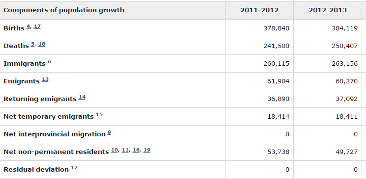

```{r setup, include=FALSE}
knitr::opts_chunk$set(echo = FALSE)
```

## Motivation

- How do events translate into metrics?
- How do current events translate?
- What are some interesting questions?

## Tools

- Exploratory Data Analysis
	+ Define expectations
	+ Plot data
	+ Check expectations
- Outcomes:
	+ Refine expectations when needed
	+ Find insights where expectations aren't met
	+ Define analomalies
- John W. Tukey - Exploratory Data Analysis, 1977

## Context

- 21st Century: 2000 - Present

- Data Sources
	+ CANSIM
	+ Statistics Canada
	+ Provincial Goverments
	+ IBIS World

- Factors
	+ GDP
	+ Demographics
	+ Employment
	+ CPI
	+ Trade

## Key Findings

- GDP Centers 
	+ Ontario & Alberta
- Largest Industry Growth
	+ Construction
	+ Services 
- Population growth
	+ Not Nesscarily GDP growth
- Population growth
	+ 2/3 Births
	+ 1/3 Immigration
- Workforce Aging
	+ Changing proportions
	
## Key Dichotomies (Findings)

- Unemployment:
	+ Western vs Eastern Canada
- Bad Effects :
	+ 2015 Oil Slump vs 2008 Recession
- Trade       :
	+ Ontario vs Alberta

## Open Questions

- Decline of Goods production stopped by recession?
- Pharamaceuticals, lower investment = same growth rates?
- Gold and Silver, major export - accomplices?
- What triggered workforce aging?


## GDP Centers
```{r, warning=FALSE}
# Save Old Parameters
opar = par()

par(mfrow=c(2,1))

# Transpose and Remove Aggregations From Data Table
Provinces <- read.csv("Data/GDP_Provinces.csv", header = T, stringsAsFactors = F)
Prov = data.frame(t(Provinces), stringsAsFactors = F)

names(Prov) = Prov[1,]

Prov = Prov[-1:-5,]

# Plot Dot charts

temp = Prov[order(Prov$`2015`),]

dotchart(
	temp$`2000`
	,labels = row.names(temp)
	,cex = 0.6
	,main = "Provincial GDP 2000"
	,sub  = "2007 Dollars"
	,xlim = c(0,650000)
)

temp = Prov[order(Prov$`2015`),]

dotchart(
	temp$`2015`
	,labels = row.names(temp)
	,cex = 0.6
	,main = "Provincial GDP 2015"
	,sub  = "2007 Dollars"
	,xlim = c(0,650000)
	)

par(opar)

```

## GDP Centers

- 1995 - 2008 Steady GDP Growth
- Resource Boom 
	+ Alberta, Saskatchewan, and Newfoundland & Labrador
- Manufacuring Declines
 	+ Employment in Ontario 15.8% (2000) versus 10.3% (2011)
	+ Automation
	+ "Global Value Chain"
	+ China

https://mowatcentre.ca/how-ontario-lost-300000-manufacturing-jobs/

https://www.fraserinstitute.org/sites/default/files/federal-fiscal-history-canada-1867-2017.pdf

## GDP Centers

- Why Ontario?
	+ 20th Century
		- Canada-United States Automotive Pact
		- NAFTA
		- Correlation To US
	+ 21st Century
		- Public Spending
		- Immagration

https://www.fraserinstitute.org/sites/default/files/can-canada-prosper-without-a-prosperous-ontario-rev.pdf

## Employment Shifts

```{r,warning=FALSE}
Emp_CAN <- read.csv("Data/Employment_Canada.csv", header = T, stringsAsFactors = F)

Emp_CAN = t(Emp_CAN)

temp = Emp_CAN[,c(1,16)]

temp = temp[-1,]

dimnames(temp)[[2]] = c("2000","2015")

temp = temp[order(temp[,1]),]


dotchart(temp[,1]
		 ,cex = 0.55
		 ,main = "2000s - Employment In Canada"
		 ,xlab = "1000's"
		 )
```

## Employment Shifts

```{r}
dotchart(temp[,2]
		 ,cex = 0.55
		 ,main = "2015s - Employment In Canada"
		 ,xlab = "1000's"
		 )

```

## Employment Shifts

- "For every job that has been lost in the goods sector since 2001, about 30 jobs have been created in service industries"

- Services as a diverse label
	+ Engineering
	+ Banking
	+ IT services
- Things In Common
	+ Demand in sophisticated professional services
	+ Remote Services, Stantec in Edmonton: 1/2 revenues outside Canadad
	+ EM Emerging middle class requires skills found elsewhere.

http://www.macleans.ca/economy/economicanalysis/the-services-industry-canadas-secret-economic-playground/

http://www.bankofcanada.ca/2016/11/growth-service-sector-helping-canadas-economy/

## Population growth != GDP growth

```{r, warning=FALSE}
Pop.Growth <- read.csv("Data/Population2000growth.csv",header = T, stringsAsFactors = F)

opar = par()

par(mfrow = c(1,2))

# Eastern Canada
plot(Pop.Growth$Geography,
	 Pop.Growth$Ontario
	 ,ylim = c(0,0.07)
	 ,type = "l"
	 ,main = "Eastern Canada"
	 ,xlab = "Year"
	 ,ylab = "Percent Growth"
	 )

lines(Pop.Growth$Geography,Pop.Growth$Quebec, col = "blue")
lines(Pop.Growth$Geography,Pop.Growth$New.Brunswick, col = "red")
lines(Pop.Growth$Geography,Pop.Growth$Prince.Edward.Island, col = "green")
lines(Pop.Growth$Geography,Pop.Growth$Newfoundland.and.Labrador, col = "orange")
lines(Pop.Growth$Geography,Pop.Growth$Nova.Scotia, col = "purple")

legend("topleft"
	   ,legend = c("Ontario","Quebec","New Brunswick","PEI","Newfoundland","Nova Scotia")
	   ,col = c("black","blue","red","green","orange","purple")
	   ,lty = 1
	   ,cex = 0.7
)
# Western Canada

plot(Pop.Growth$Geography
	 ,Pop.Growth$British.Columbia
	 ,ylim = c(0,0.07)
	 ,type = "l"
	 ,main = "Western Canada"
	 ,xlab = ""
	 ,ylab = ""	 
	 )
lines(Pop.Growth$Geography,Pop.Growth$Alberta, col = "blue")
lines(Pop.Growth$Geography,Pop.Growth$Manitoba, col = "red")
lines(Pop.Growth$Geography,Pop.Growth$Saskatchewan, col = "green")

legend("topleft"
	   ,legend = c("BC","Alberta","Manitoba","Saskatchewan")
	   ,col = c("black","blue","red","green")
	   ,lty = 1
	   ,cex = 0.7
)

par(opar)
```

## Population Growth

- Growth Rate Differences
	+ Differences in Base Proportions However
- Pre and Post 2008 Growth in Alberta
- Constant Growth for Saskatchewan


## Population growth > 1/3 Immigration



## On Immigration

- 9/11 Effects, Immigration and Refugee Protection Act 
- In Spite, Canada is recognized as one of the most open immigration countries in the world.

http://www.thecanadianencyclopedia.ca/en/article/immigration/

## Workforce Aging

```{r,warning=FALSE}
opar = par()

par(mfrow = c(1,2))
# Labour Force Population
LabourForce <- read.csv("Data/LabourForce_Canada.csv", header = T, stringsAsFactors = F)

plot(LabourForce$Year,
	 LabourForce$X15.24
	 ,ylim = c(0,10000)
	 ,type = "l"
	 ,xlab = "Year"
	 ,ylab = "Thousands"
)

lines(LabourForce$Year, LabourForce$X25.to.44.years, col = "blue")
lines(LabourForce$Year, LabourForce$X45.to.64.years, col = "red")
lines(LabourForce$Year, LabourForce$X65.years.and.over, col = "green")

legend("topleft"
	   ,legend = c("15-24","25-44","45-64","65-Over")
	   ,col = c("black","blue","red","green")
	   ,lty = 1
	   ,cex = 0.55
	   ,title = "Age Groups"
)
# Labour Force Growth Rates
LabourForceGrowth <- read.csv("Data/LabourForce_Canada_alt.csv", header = T, stringsAsFactors = F)

plot(LabourForceGrowth$Year,
	 LabourForceGrowth$X15.years.and.over
	 ,ylim = c(0,0.15)
	 ,type = "l"
	 ,xlab = "Percent Growth"
	 ,ylab = "Thousands"
)

lines(LabourForceGrowth$Year, LabourForceGrowth$X25.years.and.over, col = "blue")
lines(LabourForceGrowth$Year, LabourForceGrowth$X45.years.and.over, col = "red")
lines(LabourForceGrowth$Year, LabourForceGrowth$X55.years.and.over, col = "green")
lines(LabourForceGrowth$Year, LabourForceGrowth$X70.years.and.over, col = "orange")

legend("topleft"
	   ,legend = c("15-Over","25-Over","45-Over","55-Over", "70-Over")
	   ,col = c("black","blue","red","green","orange")
	   ,lty = 1
	   ,cex = 0.55
	   ,title = "Age Groups"
)

par = opar
```

## Workforce Aging

- Shift in growth eariler 2000's
- Long Life Spans?
- Baby Boomer Effect?
- Costlier Retirement?
- Consecquences
	+ An "Age Cliff"
	+ Productivity Effects?
	+ Expansionary Effects?
	
http://www.theglobeandmail.com/globe-investor/retirement/the-boomer-shift-how-canadas-economy-is-headed-for-majorchange/article27159892/

## Unemployment: Western vs Eastern Canada

```{r,warning=FALSE}
opar = par()

par(mfrow=c(1,2))

Uemp_prov <- read.csv("Data/Unemployment_Provinces.csv", stringsAsFactors = F, header = T)

# Western Canada
plot(
	Uemp_prov$Year
	,Uemp_prov$Canada
	,main = "Western Canada"
	,xlab = "Year"
	,ylab = "Percent"
	,ylim = c(0,20)
	,type = "l"
	,cex.main = 1
)

lines(Uemp_prov$Year,Uemp_prov$British.Columbia,col = "blue")
lines(Uemp_prov$Year,Uemp_prov$Alberta,col = "red")
lines(Uemp_prov$Year,Uemp_prov$Manitoba,col = "green")
lines(Uemp_prov$Year,Uemp_prov$Saskatchewan,col = "orange")


legend("bottomleft"
	   ,legend = c("CAN","BC","AB","MA","S")
	   ,col = c("black","blue","red","green","orange")
	   ,lty = 1
	   ,cex = 0.6
)
# Eastern Canada
plot(
	Uemp_prov$Year
	,Uemp_prov$Canada
	,main = "Eastern Canada"
	,xlab = "Year"
	,ylab = "Percent"
	,ylim = c(0,20)
	,type = "l"
	,cex.main = 1
)

lines(Uemp_prov$Year,Uemp_prov$Ontario,col = "blue")
lines(Uemp_prov$Year,Uemp_prov$Quebec,col = "red")
lines(Uemp_prov$Year,Uemp_prov$New.Brunswick,col = "green")
lines(Uemp_prov$Year,Uemp_prov$PEI,col = "orange")
lines(Uemp_prov$Year,Uemp_prov$Nova.Scotia,col = "pink")
lines(Uemp_prov$Year,Uemp_prov$Newfoundland.and.Labrador,col = "purple")

legend("bottomleft"
	   ,legend = c("CAN","ON","QB","PEI","NS","NFLL")
	   ,col = c("black","blue","red","green","orange","pink","purple")
	   ,lty = 1
	   ,cex = 0.6
)

par(opar)
```

## Unemployment:

- Eastern Canada
	+ Higher Systemic Unemployment
	+ Large Population Centres alright though
	+ Decline in Manufacturing
- Western Canada
	+ Lowever systemic unemployment
	+ 2008 verus Oil Slump effects
	+ Boom in natural resources

## 2015 Oil Slump vs 2008 Recession

```{r,warning=FALSE}
Trade_Provinces <- read.csv("Data/Trade_Provinces.csv", header = T, stringsAsFactors = F)

matplot(Trade_Provinces$Year
		, Trade_Provinces[-1]
		, type = 'l'
		, main = "Balance of Trade by provinces"
		, xlab = "year"
		, ylab = "Canadian Dollars (Millions)"
		, col  = c(1:ncol(Trade_Provinces[-1]))
)
legend("bottomleft", legend = names(Trade_Provinces[-1]), pch=1, col = c(1:ncol(Trade_Provinces[-1])), cex =0.6)
```

## 2015 Oil Slump vs 2008 Recession

```{r}
plot(
	Uemp_prov$Year
	,Uemp_prov$Canada
	,main = "Western Canada"
	,xlab = "Year"
	,ylab = "Percent"
	,ylim = c(0,20)
	,type = "l"
	,cex.main = 1
)

lines(Uemp_prov$Year,Uemp_prov$British.Columbia,col = "blue")
lines(Uemp_prov$Year,Uemp_prov$Alberta,col = "red")
lines(Uemp_prov$Year,Uemp_prov$Manitoba,col = "green")
lines(Uemp_prov$Year,Uemp_prov$Saskatchewan,col = "orange")


legend("bottomleft"
	   ,legend = c("CAN","BC","AB","MA","S")
	   ,col = c("black","blue","red","green","orange")
	   ,lty = 1
	   ,cex = 0.6
)
```

## 2015 Oil Slump vs 2008 Recession

- Export Effects?
- Employment Effects?


## Trade: Ontario vs Alberta

```{r,warning=FALSE}
Trade_Provinces <- read.csv("Data/Trade_Provinces.csv", header = T, stringsAsFactors = F)

matplot(Trade_Provinces$Year
		, Trade_Provinces[-1]
		, type = 'l'
		, main = "Balance of Trade by provinces"
		, xlab = "year"
		, ylab = "Canadian Dollars (Millions)"
		, col  = c(1:ncol(Trade_Provinces[-1]))
)
legend("bottomleft", legend = names(Trade_Provinces[-1]), pch=1, col = c(1:ncol(Trade_Provinces[-1])), cex =0.6)
```